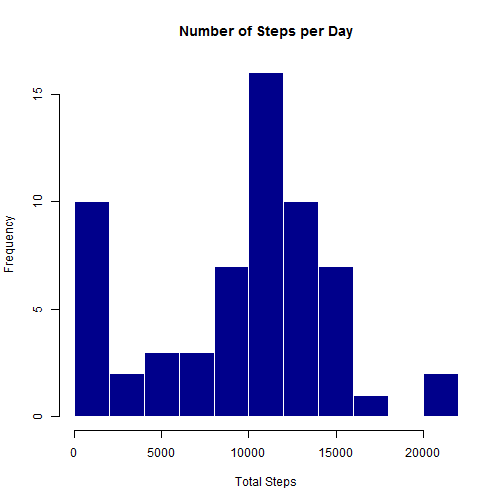
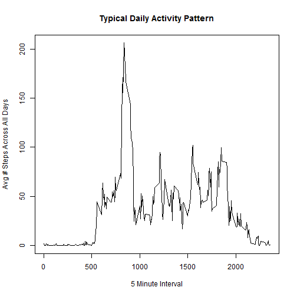
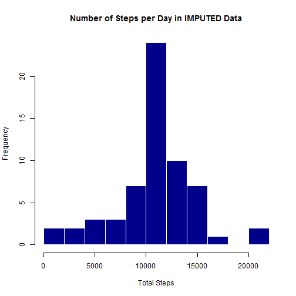
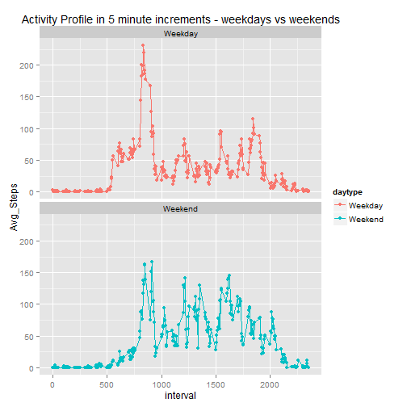

This assignment is for the coursera class "Reproducable Research".  The assignment looks at a set of pedometer data but more importantly, it uses markdown to create a document which is going to be peer reviews.  This is that markdown.

## Loading and preprocessing the data

First, I am going to read in my data which is stored in a directory sepecific to this assignment.  I have appended the word raw to the file name to help make sure that I always retain the original data and format.


```r
setwd("C:\\Users\\phc\\Documents\\GitHub\\RepData_PeerAssessment1")
data <- read.csv("activity_RAW.csv", header = TRUE, sep=",")
summary(data)
```

```
##      steps                date          interval     
##  Min.   :  0.00   2012-10-01:  288   Min.   :   0.0  
##  1st Qu.:  0.00   2012-10-02:  288   1st Qu.: 588.8  
##  Median :  0.00   2012-10-03:  288   Median :1177.5  
##  Mean   : 37.38   2012-10-04:  288   Mean   :1177.5  
##  3rd Qu.: 12.00   2012-10-05:  288   3rd Qu.:1766.2  
##  Max.   :806.00   2012-10-06:  288   Max.   :2355.0  
##  NA's   :2304     (Other)   :15840
```


##What is mean total number of steps taken per day?

1. Calculate the total number of steps taken per day
2. Make a histogram of the total number of steps taken each day
3. Calculate and report the mean and median of the total number of steps taken per day


First, I calculate the number of steps for each day in the data set while ignoring the NA values.  


```r
##install.packages("plyr")
library(plyr)
Steps_Per_Day <- ddply(data,~date,summarise,Total_Steps=sum(steps,na.rm=TRUE))
```

Now, let's take a look at the histogram to see what kind of activity level our subject generally has.


```r
hist(Steps_Per_Day$Total_Steps,breaks=10, col="darkblue", border="white",main="Number of Steps per Day", xlab="Total Steps")
```

 

And over the total month, what is the mean, median and total number of steps?... easy.


```r
mean(Steps_Per_Day$Total_Steps)
```

```
## [1] 9354.23
```

```r
median(Steps_Per_Day$Total_Steps)
```

```
## [1] 10395
```

```r
sum(Steps_Per_Day$Total_Steps)
```

```
## [1] 570608
```

##What is the average daily activity pattern?

Let's take a look at the activity pattern across a typical day.  Is our subject more active in the morning or at night?  


```r
##install.packages("plyr")
##library(plyr)
Avg_Steps_Per_Interval <- ddply(data,~interval,summarise,Avg_Steps=mean(steps,na.rm=TRUE))

plot(Avg_Steps_Per_Interval$interval, as.numeric(Avg_Steps_Per_Interval$Avg_Steps), type = "l", xlab="5 Minute Interval", ylab="Avg # Steps Across All Days", main="Typical Daily Activity Pattern")
```

 

Which interval is the most active of all?


```r
Avg_Steps_Per_Interval[which(Avg_Steps_Per_Interval$Avg_Steps == max(Avg_Steps_Per_Interval$Avg_Steps)),]
```

```
##     interval Avg_Steps
## 104      835  206.1698
```


##Imputing Missing Values

Calculate and report the total number of missing values in the dataset (i.e. the total number of rows with NAs) 


```r
sum(is.na(data$steps))
```

```
## [1] 2304
```

Devise a strategy for filling in all of the missing values in the dataset. The strategy does not need to be sophisticated. For example, you could use the mean/median for that day, or the mean for that 5-minute interval, etc.

*I like the average for that interval rather than for the day.

Create a new dataset that is equal to the original dataset but with the missing data filled in.


```r
Avg_Steps_Per_Interval <- ddply(data,~interval,summarise,Avg_Steps=mean(steps,na.rm=TRUE))
I_data <- data

I_data <- merge(I_data, Avg_Steps_Per_Interval, by="interval", all=TRUE)
I_data$steps[is.na(I_data$steps)]<-I_data$Avg_Steps[is.na(I_data$steps)]
I_data <- I_data[,c("steps", "date", "interval"),drop=TRUE]
```


Time to repeat the stuff done in the first step of the assignment so we can compare the results of the imputed data and the original data.


```r
I_Steps_Per_Day <- ddply(I_data,~date,summarise,Total_Steps=sum(steps,na.rm=TRUE))
hist(I_Steps_Per_Day$Total_Steps,breaks=10, col="darkblue", border="white",main="Number of Steps per Day in IMPUTED Data", xlab="Total Steps")
```

 


And for reference ... here is the original histogram...


```r
hist(Steps_Per_Day$Total_Steps,breaks=10, col="darkblue", border="white",main="Number of Steps per Day", xlab="Total Steps")
```

 


**Looking at the original histogram, I think our imputed data over inflates activity during certain times...We can see the high activity at the beginning of the day (after midnight)  But this was probably a small number of occurrances of late night activity which later got applied to all days.... in hindsight, it might have been better to just fill the NAs in with zeros.... live and learn.


Now for the mean, median, and total for the imputed values.  


```r
mean(I_Steps_Per_Day$Total_Steps)
```

```
## [1] 10766.19
```

```r
median(I_Steps_Per_Day$Total_Steps)
```

```
## [1] 10766.19
```

```r
sum(I_Steps_Per_Day$Total_Steps)
```

```
## [1] 656737.5
```

And for reference... here are the original values...

```r
mean(Steps_Per_Day$Total_Steps)
```

```
## [1] 9354.23
```

```r
median(Steps_Per_Day$Total_Steps)
```

```
## [1] 10395
```

```r
sum(Steps_Per_Day$Total_Steps)
```

```
## [1] 570608
```


##Are there differences in activity patterns between weekdays and weekends?

First, let's add a field to our imputed data to tell us if this is a weekday or weekend.


```r
I_data$date <- as.POSIXct(I_data$date)
I_data$weekday <- weekdays(I_data$date)
# Must do the not before the in
I_data$daytype[! (I_data$weekday %in% c("Saturday", "Sunday"))]<-"Weekday"
I_data$daytype[I_data$weekday %in% c("Saturday", "Sunday")]<-"Weekend"

head(I_data,20)
```

```
##        steps       date interval   weekday daytype
## 1   1.716981 2012-10-01        0    Monday Weekday
## 2   0.000000 2012-11-23        0    Friday Weekday
## 3   0.000000 2012-10-28        0    Sunday Weekend
## 4   0.000000 2012-11-06        0   Tuesday Weekday
## 5   0.000000 2012-11-24        0  Saturday Weekend
## 6   0.000000 2012-11-15        0  Thursday Weekday
## 7   0.000000 2012-10-20        0  Saturday Weekend
## 8   0.000000 2012-11-16        0    Friday Weekday
## 9   0.000000 2012-11-07        0 Wednesday Weekday
## 10  0.000000 2012-11-25        0    Sunday Weekend
## 11  1.716981 2012-11-04        0    Sunday Weekend
## 12  0.000000 2012-11-08        0  Thursday Weekday
## 13  0.000000 2012-10-12        0    Friday Weekday
## 14  0.000000 2012-10-30        0   Tuesday Weekday
## 15  0.000000 2012-11-26        0    Monday Weekday
## 16 47.000000 2012-10-04        0  Thursday Weekday
## 17  0.000000 2012-11-27        0   Tuesday Weekday
## 18  0.000000 2012-10-31        0 Wednesday Weekday
## 19  0.000000 2012-11-18        0    Sunday Weekend
## 20  0.000000 2012-10-05        0    Friday Weekday
```

Now lets plot weekdays and weekend seperately


```r
I_Avg_Steps_Per_Interval <- ddply(I_data, .(interval,daytype),summarise,Avg_Steps=mean(steps))

##install.packages("ggplot2")
library(ggplot2)

ggplot(data=I_Avg_Steps_Per_Interval, aes(x=interval, y=Avg_Steps, group=daytype, colour=daytype)) +
    ggtitle("Activity Profile in 5 minute increments - weekdays vs weekends") +
    geom_line() +
    geom_point() +
    facet_wrap(~daytype, nrow=2)
```

 

It looks like our subject likes to sleep in a little later on the weekends and the spike during the weekdays probably corresponds to their commute.

##Have a great week!
